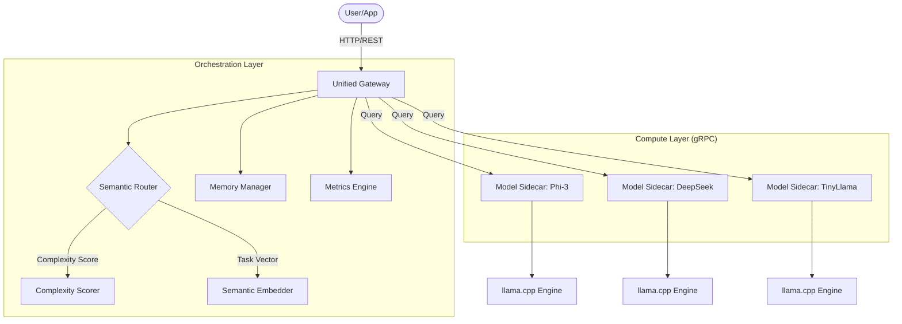

# 🌌 Sovereign Orchestrator (AIORC)

[](https://www.rust-lang.org)
[](https://grpc.io)
[](LICENSE)

**Sovereign Orchestrator** is a high performance, resource efficient AI orchestration layer designed to coordinate multiple locally hosted Small Language Models (SLMs) into a single, unified logical unit. Built in Rust with gRPC, it enables enterprise grade AI capabilities on consumer grade hardware.


## 🏗️ System Architecture

The system follows a modular, sidecar based architecture where a central **Gateway** handles routing and memory management, while individual **Sidecars** wrap inference engines.



---

## 📂 Project Layout

```text
AIORC/
├── proto/               # gRPC Service Definitions
│   └── orchestrator.proto
├── src/
│   ├── main.rs          # Project Entry Point
│   ├── bin/             # Binary Targets
│   │   ├── gateway.rs   # Unified HTTP Gateway
│   │   ├── sidecar.rs   # Model Sidecar gRPC Wrapper
│   │   └── router.rs    # Routing CLI Demo
│   ├── core/            # Shared Types, Config, & Errors
│   ├── gateway/         # HTTP Handlers & Web Server
│   ├── inference/       # Inference Engine & Sidecar Logic
│   ├── memory/          # VRAM Warm-Swap & Semantic Cache
│   └── routing/         # Complexity Scoring & Model Selection
├── build.rs             # Protobuf Compilation Script
├── config.json          # System Configuration
└── Cargo.toml           # Rust Dependencies
```

---

## 🚀 Key Components & Connections

### 1. **Unified Gateway (`src/bin/gateway.rs`)**
The entry point for all client requests. It exposes an Axum based HTTP REST API and coordinates with the internal modules to fulfill queries.

### 2. **Semantic Router (`src/routing/`)**
The "brain" of the orchestrator. It performs a two stage analysis:
- **Complexity Scoring:** Analyzes prompt structure to determine if it needs a small, fast model or a larger, analytical one.
- **Task Classification:** Maps prompts to specific domains (Code, Logic, Creative, etc.) using lightweight semantic embeddings.

### 3. **Memory Manager (`src/memory/`)**
Implements a **Warm-Swap** strategy. It tracks VRAM usage across models and manages an LRU (Least Recently Used) cache to swap model weights between System RAM and VRAM/NVMe, ensuring sub 500ms model readiness.

### 4. **Model Sidecars (`src/bin/sidecar.rs`)**
Each model runs in its own process, wrapped by a gRPC sidecar. This allows for:
- **Isolation:** Crashing one model doesn't bring down the orchestrator.
- **Scalability:** Sidecars can run on different GPUs or even different machines.
- **Abstraction:** The gateway speaks a unified gRPC protocol regardless of the underlying inference engine.

### 5. **Semantic Cache (`src/memory/semantic_cache.rs`)**
A local vector based cache that stores previously computed "logic chains." If a new prompt is semantically similar to a cached one, the system can return the cached result instantly.

---

## 🛠️ Getting Started

### Prerequisites
- **Rust Stable** (1.75+)
- **Protobuf Compiler** (`protoc`)

### Installation

1. Clone the repository:
   ```bash
   git clone https://github.com/paulmmoore3416/AIORC.git
   cd AIORC
   ```

2. Build the project:
   ```bash
   # Ensure protoc is in your path
   cargo build --release
   ```

### Running the Orchestrator

1. **Start the Gateway:**
   ```bash
   cargo run --release --bin orchestrator_gateway
   ```

2. **Start a Model Sidecar (Terminal 2):**
   ```bash
   MODEL_ID=phi-3 PORT=50051 cargo run --release --bin model_sidecar
   ```

3. **Query the API:**
   ```bash
   curl -X POST http://localhost:9090/query \
     -H "Content-Type: application/json" \
     -d '{"prompt": "Write a Rust function for a binary search", "temperature": 0.7}'
   ```

---

## 📊 Performance Targets
- **Routing Latency:** < 50ms
- **Model Swap Time:** < 400ms (NVMe to VRAM)
- **Max Throughput:** 50+ RPS (on consumer 3060/4060 GPUs)

---

## License
Distributed under the MIT License. See `LICENSE` for more information.
